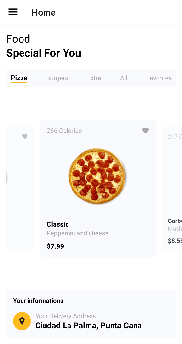
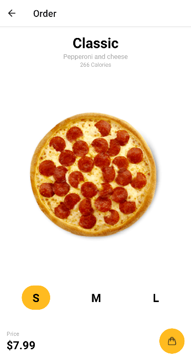
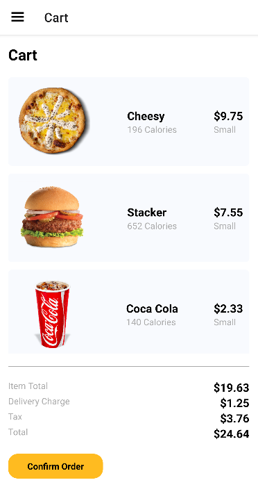

<p align="center">
   
</p>

# Yummify - WIP 🚧

[](https://github.com/JuanGabriel2960)
[](#)

<p>
  <a href="#closed_book-about-the-project">About the project</a>&nbsp;&nbsp;&nbsp;|&nbsp;&nbsp;&nbsp;
  <a href="#construction_worker-installation">Installation</a>&nbsp;&nbsp;&nbsp;|&nbsp;&nbsp;&nbsp;
  <a href="#rocket-getting-started">Getting Started</a>&nbsp;&nbsp;&nbsp;|&nbsp;&nbsp;&nbsp;
  <a href="#hammer-built-with">Built with</a>&nbsp;&nbsp;&nbsp;
</p>

<br>
<p align="center">
  &nbsp;&nbsp;&nbsp;&nbsp;&nbsp;&nbsp;
  &nbsp;&nbsp;&nbsp;&nbsp;&nbsp;&nbsp;
  &nbsp;&nbsp;&nbsp;&nbsp;&nbsp;&nbsp;
</p>
<br>

# :closed_book: About the project

Mobile application for customers which is responsible for managing fast food deliveries at home. It has authentication, shopping cart, location, payments, among other common features in a delivery app.

# :construction_worker: Installation

**You need to install [Node.js](https://nodejs.org/en/download/), [Yarn](https://yarnpkg.com/) & [Android SDK](https://reactnative.dev/docs/environment-setup) first, then in order to clone the project via HTTPS, run this command:**

```git clone https://github.com/JuanGabriel2960/yummify.git```

Or via SSH:

```git clone git@github.com:JuanGabriel2960/yummify.git```

**Install dependencies**

```yarn install```

# :rocket: Getting Started

### `npx react-native start`

Start the Metro console bundler, the JavaScript bundler that ships with React Native. Metro "takes in an entry file and various options, and returns a single JavaScript file that includes all your code and its dependencies."

### `npx react-native run-android`

Let Metro Bundler run in its own terminal. Open a new terminal inside the React Native project folder and run npx react-native run-android. If everything is set up correctly, you should see your new app running in your Android emulator shortly.

# :hammer: Built With

- [React Native](https://reactnative.dev/)
- [React Navigation](https://reactnavigation.org/)
- [TypeScript](https://www.typescriptlang.org/)
- [Java](https://www.java.com/en/)